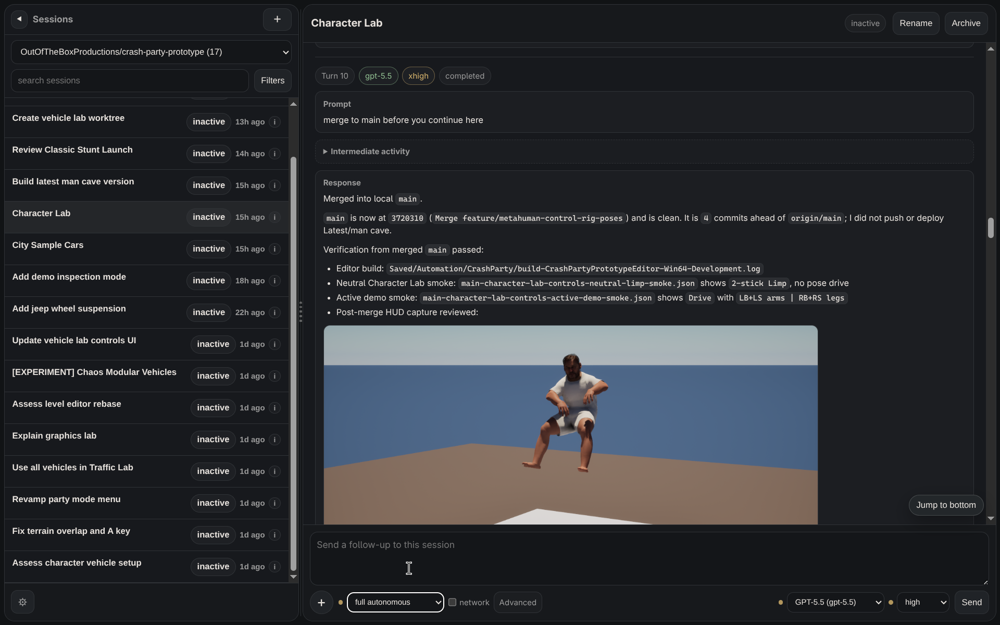

# Codex Control

Codex Control is a local web UI for viewing and managing Codex app-server sessions from a browser.

It works without project-specific setup: install dependencies, start the server, and open the local URL. The default local mode is read/write, because continuing sessions and creating worktrees are core features. If you expose it beyond localhost, treat it like an admin tool for your Codex account and local filesystem.

## Quick Start

```sh
npm install
npm start
```

Open <http://127.0.0.1:4567>.

## Requirements

- Node.js 18 or newer.
- A working `codex` command on the same machine running Codex Control.
- Codex app-server support in the installed Codex version.
- Local access to the repositories/worktrees you want to use.

[](public/assets/codex-control-screenshot.png)

## What You Can Do

- Browse Codex sessions across repositories.
- Search, filter, group, and inspect session transcripts.
- Open existing session details, metadata, images, Markdown, and recent events.
- Start new sessions from local Git worktrees.
- Send follow-up prompts with optional file/image attachments.
- Queue prompts while a turn is running.
- Steer or stop active turns.
- Rename, archive, and unarchive sessions.
- Choose model, reasoning effort, sandbox, approval, and network settings for future normal turns.

## Read-Only Mode

Set `CODEX_CONTROL_READ_ONLY=1` when Codex Control should only inspect existing sessions.

Read-only mode disables server routes that create or mutate sessions, worktrees, queued prompts, turns, archive state, names, and development restarts. The UI hides write controls such as the prompt bar, new-session button, repo add controls, worktree creation controls, session rename/archive actions, and queued-message actions.

Use read-only mode for demos, browsing-only deployments, or any environment where viewers should not be able to act through your Codex account.

```sh
CODEX_CONTROL_READ_ONLY=1 npm start
```

On Windows PowerShell:

```powershell
$env:CODEX_CONTROL_READ_ONLY='1'
npm start
```

## Basic Use

1. Start Codex Control.
2. Choose a repository from the repo filter, or add one by URL or `owner/repository`.
3. Select a session from the left pane.
4. Inspect the transcript, metadata, images, and recent events.
5. In read/write mode, use the prompt bar to continue the session.

## Repositories

Repository selection is explicit:

- Paste a GitHub SSH/HTTPS repository URL or `owner/repository` via **Add repo**.
- Custom repositories are stored in browser `localStorage`.
- Codex-known repositories are discovered from `thread/list` git metadata.

GitHub repository listing can be added later as an optional provider. Paste-by-URL remains the reliable fallback.

## Worktrees

Codex Control can create a branch worktree from a selected source worktree.

No JSON config is required for the default behavior. The target root is inferred from the source path:

- If the source is already under a `worktrees` or `*-worktrees` directory, new worktrees are placed beside it.
- Otherwise, the default target root is a sibling `*-worktrees` directory.

Use the worktree root override in the dialog when your local layout is different for one creation. Use `codex-control.config.json` only when you want Codex Control to always create worktrees in a specific local layout.

Paths are always paths on the machine running Codex Control, even if you open the UI from another computer.

## Environment Configuration

Configuration can be set in the process environment or in a local `.env` file. Process environment values take precedence over `.env` values.

| Variable | Default | Purpose |
| --- | --- | --- |
| `HOST` | `127.0.0.1` | Bind host for the web server. |
| `PORT` | `4567` | Bind port for the web server. |
| `CODEX_CONTROL_READ_ONLY` | `0` / unset | Set to `1`, `true`, `yes`, or `on` to disable mutating actions. |
| `CODEX_CONTROL_AUTH` | `none` | Set to `basic` to require HTTP Basic Auth for all routes except `/api/health`. |
| `CODEX_CONTROL_AUTH_USER` | `admin` | Username for built-in Basic Auth. |
| `CODEX_CONTROL_AUTH_PASSWORD` | unset | Plain-text Basic Auth password. Prefer a local `.env`, not a committed file. |
| `CODEX_CONTROL_AUTH_PASSWORD_SHA256` | unset | SHA-256 hex hash alternative to `CODEX_CONTROL_AUTH_PASSWORD`. |
| `CODEX_CONTROL_ALLOW_UNAUTHENTICATED_NETWORK` | unset | Set to `1` only when you deliberately expose without built-in auth because another trusted layer protects access. |
| `CODEX_CONTROL_FILE_SERVING` | `session` | Controls local file links. Use `session` for session-policy access or `system` to serve any local file path. |
| `CODEX_CONTROL_DEV_RESTART` | unset | Set to `1` to enable the development-only `/api/codex/restart` endpoint. |
| `CODEX_CONTROL_RESTART_TASK` | unset | Optional Windows Scheduled Task name used by the restart helper. |

See `.env.example` for a local environment template.

## Authentication

Built-in authentication is disabled by default. For trusted localhost use, that is usually fine:

```env
CODEX_CONTROL_AUTH=none
```

When binding to a Tailscale/VPN address, LAN address, or reverse proxy, either protect access externally or enable built-in Basic Auth by setting `CODEX_CONTROL_AUTH=basic`:

```env
CODEX_CONTROL_AUTH=basic
CODEX_CONTROL_AUTH_USER=admin
CODEX_CONTROL_AUTH_PASSWORD=change-this
```

For persistent config, prefer storing a SHA-256 password hash:

```powershell
$password = 'change-this'
$bytes = [System.Text.Encoding]::UTF8.GetBytes($password)
$hash = [System.Security.Cryptography.SHA256]::HashData($bytes)
($hash | ForEach-Object ToString x2) -join ''
```

Then set:

```env
CODEX_CONTROL_AUTH=basic
CODEX_CONTROL_AUTH_USER=admin
CODEX_CONTROL_AUTH_PASSWORD_SHA256=<hex-hash>
```

## Advanced Worktree Configuration

Most users do not need this.

Host-specific worktree configuration lives in `codex-control.config.json` at the repository root. This file is ignored by Git because it can contain personal paths.

See `codex-control.config.example.json` for a template.

Example:

```json
{
  "workspaceRoots": [
    "C:/Users/you/work"
  ],
  "defaultWorktreeWorkflow": "bare-container",
  "worktreeWorkflows": {
    "bare-container": {
      "label": "Bare repo container with worktrees",
      "branchWorktree": "{workspaceRoot}/{repoName}/worktrees/{branchName}"
    },
    "auto-sibling": {
      "label": "Auto sibling worktrees",
      "branchWorktree": "{autoWorktreeRoot}/{branchName}"
    }
  }
}
```

Available template variables:

- `{workspaceRoot}`: configured workspace root that best contains the selected source worktree, falling back to the first configured root.
- `{repoName}`: inferred repository folder name.
- `{sourcePath}`: selected source worktree path.
- `{sourceParent}`: parent directory of the selected source worktree.
- `{sourceName}`: folder name of the selected source worktree.
- `{autoWorktreeRoot}`: default sibling worktree root inferred from the selected source path.
- `{branchName}`: branch name exactly as entered.
- `{branchFolder}`: branch name sanitized for a single folder segment.

Path resolution uses the machine running Codex Control, not the browser machine.

## Optional Restart Helper

During development, restart the local server process however you normally manage local Node services.

An optional Windows helper is available for local environments that use a Windows Scheduled Task:

```powershell
npm run restart:windows
```

The helper refuses to restart while sessions are active, because the current Codex Control server owns its `codex app-server` child process and stopping Node interrupts active turns. Use an explicit forced restart only when interruption is intentional:

```powershell
npm run restart:windows:force
```

Set `CODEX_CONTROL_RESTART_TASK` when the scheduled task name is not the helper default.

## Safety Notes

- Treat read/write mode as local-trusted/admin access. Users can continue Codex sessions, create worktrees, attach files, rename/archive sessions, and trigger actions through your Codex account.
- Do not expose the server to the public internet without an authentication layer and deliberate access controls. Prefer localhost, Tailscale/VPN, SSH tunnel, or a trusted reverse proxy.
- If other people can reach the UI and should not control your sessions, enable `CODEX_CONTROL_READ_ONLY=1`.
- File attachments are saved into the target session worktree under `.codex-control/attachments`.
- By default, local file links follow the session permission policy. Normal and read-only sessions only serve files under the session worktree; sessions using `dangerFullAccess` may serve arbitrary local file paths mentioned in that session.
- Set `CODEX_CONTROL_FILE_SERVING=system` only when you explicitly want Codex Control to serve any local file path it can read, independent of session permissions.
- Do not commit machine-specific operational notes, private handoff notes, local thread IDs, personal paths, or deployment details.

## Troubleshooting

- If a Codex session stops responding or fails immediately, check the Codex/OpenAI account state first. Expired auth, exhausted credits, quota limits, or model access changes can look like app failures.

## Official Codex App Server Docs

Codex app-server protocol details are covered in the agent/developer docs for this repository. Prefer those docs when changing protocol calls.
